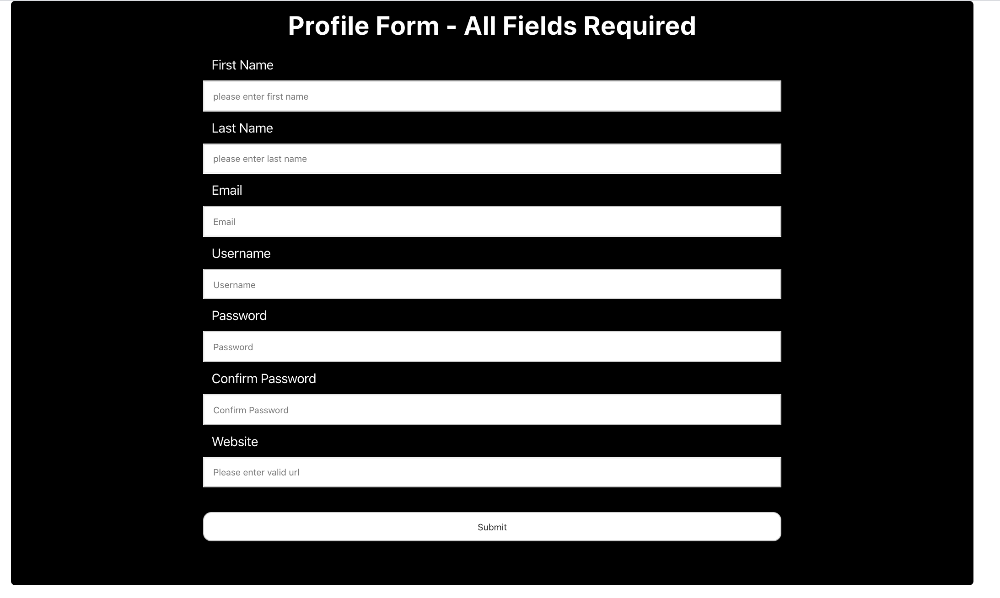

# React Form Information Validation 

## Challenges I Faced? 

Validating information to make sure that it's at least correctly formatted, is a pretty straightforward concept. Due to the fact that there are so many different ways to accomplish this it was difficult to choose which way would be the best.

## How Did I Over Come Those Challenges? 

After doing research I discovered a npm package called validator.js, And after reading over the course material as well as the documentation on npm, I was able to efficiently and correctly implement the package to complete the assigned task.

## What Did I Learn?

* How to install an npm package
* How to validate user inputs
* Improved HTML knowledge 
* Sharpened CSS capabilities
* Reinforced JavaScript principles 

